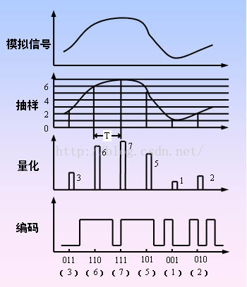

PCM 脉冲编码调制是Pulse Code Modulation的缩写。脉冲编码调制是数字通信的编码方式之一。主要过程是将话音、图像等模拟信号每隔一定时间进行取样，使其离散化，同时将抽样值按分层单位四舍五入取整量化，同时将抽样值按一组二进制码来表示抽样脉冲的幅值。

# 编码过程
模拟信号数字化必须经过三个过程，即抽样、量化和编码，以实现话音数字化的脉冲编码调制（PCM，Pulse Coding Modulation）技术。

## 1、抽样(Sampling)
抽样是把模拟信号以其信号带宽2倍以上的频率提取样值，变为在时间轴上离散的抽样信号的过程。例如，话音信号带宽被限制在0.3～3.4kHz内，用 8kHz的抽样频率（fs），就可获得能取代原来连续话音信号的抽样信号。对一个正弦信号进行抽样获得的抽样信号是一个脉冲幅度调制（PAM）信号，如下图对模拟正弦信号的抽样所示。对抽样信号进行检波和平滑滤波，即可还原出原来的模拟信号。

## 2、量化（quantizing）
抽样信号虽然是时间轴上离散的信号，但仍然是模拟信号，其样值在一定的取值范围内，可有无限多个值。显然，对无限个样值一一给出数字码组来对应是不可能的。为了实现以数字码表示样值，必须采用“四舍五入”的方法把样值分级“取整”，使一定取值范围内的样值由无限多个值变为有限个值。这一过程称为量化。
量化后的抽样信号与量化前的抽样信号相比较，当然有所失真，且不再是模拟信号。这种量化失真在接收端还原模拟信号时表现为噪声，并称为量化噪声。量化噪声的大小取决于把样值分级“取整”的方式，分的级数越多，即量化级差或间隔越小，量化噪声也越小。

## 3、编码（Coding）
量化后的抽样信号在一定的取值范围内仅有有限个可取的样值，且信号正、负幅度分布的对称性使正、负样值的个数相等，正、负向的量化级对称分布。若将有限个 量化样值的绝对值从小到大依次排列，并对应地依次赋予一个十进制数字代码（例如，赋予样值0的十进制数字代码为0），在码前以“+”、“－”号为前缀，来 区分样值的正、负，则量化后的抽样信号就转化为按抽样时序排列的一串十进制数字码流，即十进制数字信号。简单高效的数据系统是二进制码系统，因此，应将十 进制数字代码变换成二进制编码。根据十进制数字代码的总个数，可以确定所需二进制编码的位数，即字长。这种把量化的抽样信号变换成给定字长的二进制码流的 过程称为编码。