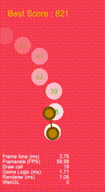
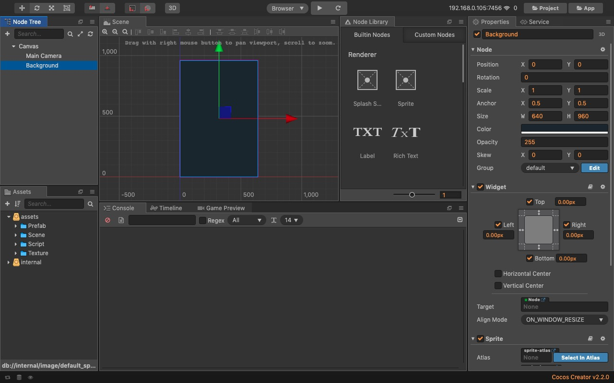
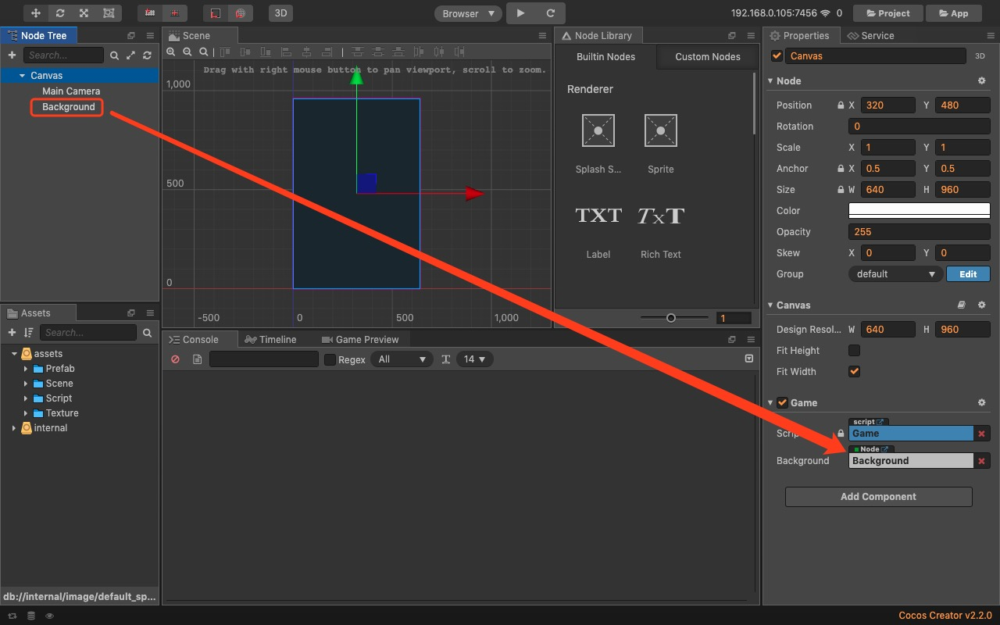
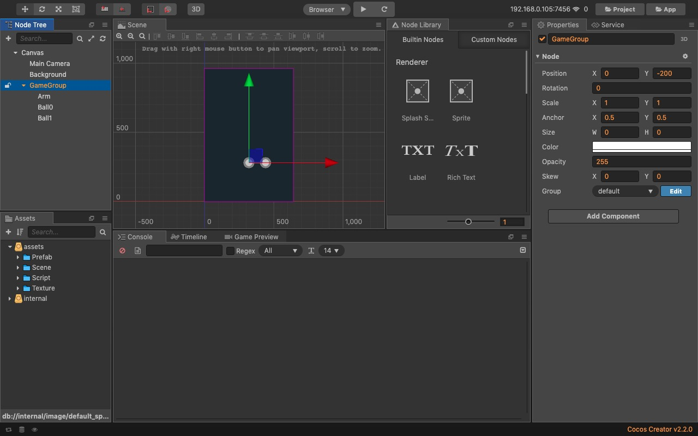
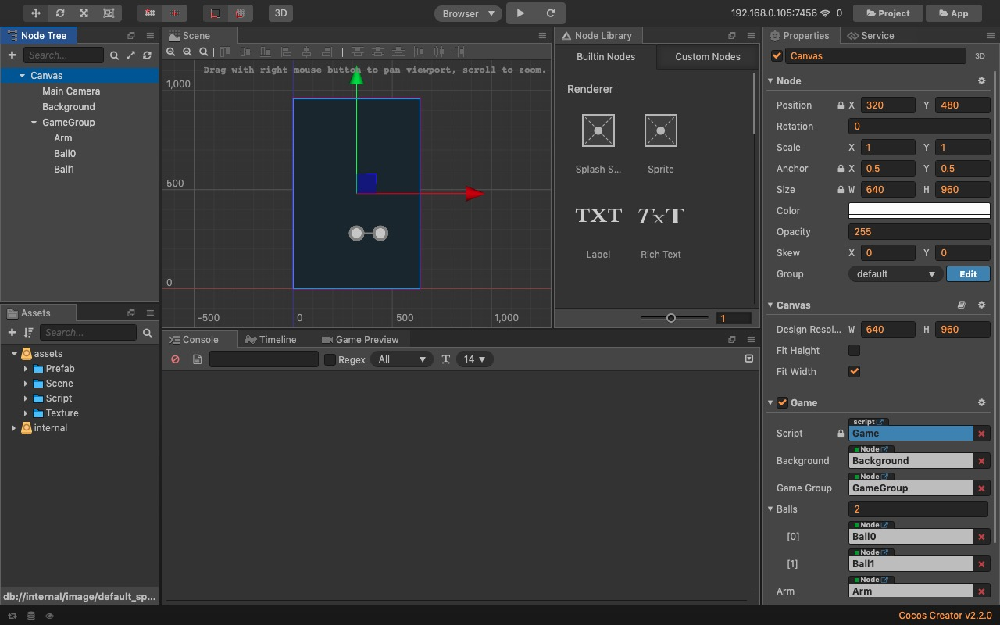

# 游戏预览  


# 游戏管理器
新建Game.js，用于管理游戏相关逻辑，作为组件挂载到Canvas节点。

# 绘制背景
在Canvas节点下添加Sprite Node节点，撑满背景：


游戏开始前需要随机设置背景色，预先全局定义一组颜色：
```
var bgColors = ['#62bd18', "#ffbb00", '#ff5300', '#d21034', '#ff475c', '#8f16b2'];
```

声明背景节点的属性，并在属性检查器中拖入背景节点设置：
```
properties: {
    background: {
        default: null,
        type: cc.Node
    }
},
```


在给定的一组颜色中，随机获取一个颜色，设置为背景的颜色：
```
let colorIndex = Math.floor(Math.random() * bgColors.length);
this.backgroundColor = bgColors[colorIndex];
this.background.color = cc.Color.BLACK.fromHEX(this.backgroundColor);
```

# 转动的球
游戏中会有两个球交替转动，如果转动的球命中目标球，整体会移到横向的中心点，所以先添加一个GameGroup节点，用于整体移动所有球。然后在GameGroup节点下添加三个Sprite Node节点，分别为两个转动的球Ball0和Ball1，一个球的连接杆Arm，为方便杆转动，将连接杆的锚点设置为(0, 0.5)：


全局添加两个球之前的距离：
```
var ballDistance = 120;
```

在脚本声明相关属性，并拖入属性检查器设置：
```
properties: {
    background: {
        default: null,
        type: cc.Node
    },
    gameGroup: {
        default: null,
        type: cc.Node
    },
    balls: [cc.Node],
    arm: {
        default: null,
        type: cc.Node
    }
},
```


初始化转动球和杆，设置的颜色需要避免跟背景颜色一样：
```
do {
    this.tintColor = bgColors[Math.floor(Math.random() * bgColors.length)];
} while (this.backgroundColor == this.tintColor)

this.gameGroup.position = cc.v2(this.solidBallPosX, this.solidBallPosY);
this.arm.active = true;
this.arm.color = cc.Color.BLACK.fromHEX(this.tintColor);
this.arm.position = cc.v2(100, 0);
this.arm.angle = 0;
this.balls[0].color = cc.Color.BLACK.fromHEX(this.tintColor);
this.balls[0].position = cc.v2(100, 0);
this.balls[0].opacity = 255;
this.balls[1].color = cc.Color.BLACK.fromHEX(this.tintColor);
this.balls[1].position = cc.v2(220, 0);
this.balls[1].opacity = 255;
```

添加球转动需要的变量：
```
//转动的角度
this.rotationAngle = 0;
//正在转动的球，0或者1
this.rotatingBall = 1;
//旋转的速度
this.saveRotationSpeed = 4;
//旋转的方向，随机
this.rotatingDirection = Math.round(Math.random() * 1);
```

在update()里更新转动的角度：
```
this.rotationAngle = (this.rotationAngle + this.saveRotationSpeed * (this.rotatingDirection * 2 - 1)) % 360;
this.arm.angle = this.rotationAngle + 90;
this.balls[this.rotatingBall].x = this.balls[1 - this.rotatingBall].x - ballDistance * Math.sin(this.rotationAngle / 180 * Math.PI);
this.balls[this.rotatingBall].y = this.balls[1 - this.rotatingBall].y + ballDistance * Math.cos(this.rotationAngle / 180 * Math.PI);
```
