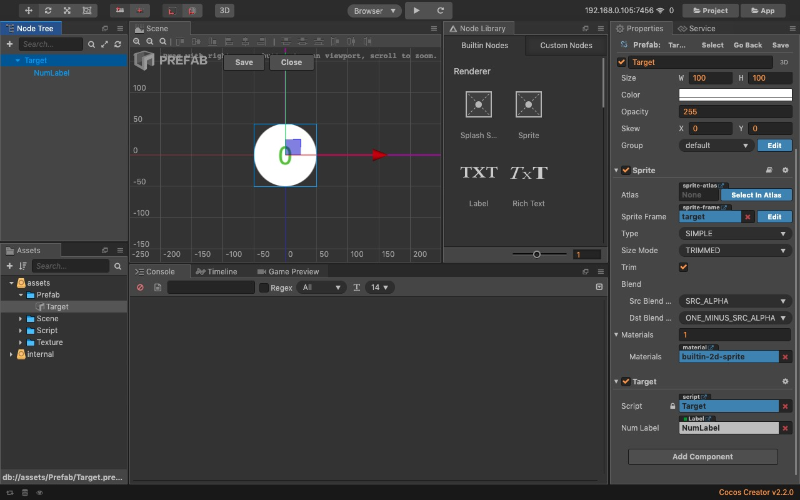
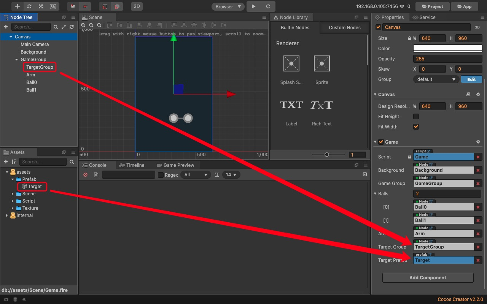

# Target预制体
添加Sprite Node节点，命名为Target，添加Target.js脚本组件：
```
//声明属性
properties: {
    numLabel: {
        default: null,
        type: cc.Label
    },
},

//设置目标球的数字
setTargetNum (num) {
    this.numLabel.string = num;
}
```

在Target节点下添加Node With Label节点显示数字，并在属性检查器的Target组件设置numLabel，然后拖动Target节点到assets下做成预制资源。


在GameGroup节点下添加TargetGroup节点，用于目标球节点容器。
在Game.js脚本添加Target预制体和TargetGroup对应的属性，并拖入设置：
```
properties: {
    background: {
        default: null,
        type: cc.Node
    },
    gameGroup: {
        default: null,
        type: cc.Node
    },
    balls: [cc.Node],
    arm: {
        default: null,
        type: cc.Node
    },
    targetGroup: {
        default: null,
        type: cc.Node
    },
    targetPrefab: {
        default: null,
        type: cc.Prefab
    }
},
```


# Target对象池
初始化Target预制体的对象池：
```
this.targetPool = new cc.NodePool();
```

向对象池申请一个节点，如果对象池里有空闲的可用节点，就把节点返回，没有就实例化一个Prefab：
```
getTargetPrefab () {
    let targetNode = this.targetPool.get();
    if (targetNode == null) {
        targetNode = cc.instantiate(this.targetPrefab);
    }
    return targetNode;
}
```

销毁节点时，直接通过对象池实例的put(node)方法，对象池会自动把节点从场景节点树中移除，然后返回给对象池。
```
removeTargetPrefab (targetNode) {
    this.targetPool.put(targetNode); 
}
```

# 目标球组
添加全局变量：
```
//生成每个目标球的角度范围：
var angleRange = [25, 155];
//可见的目标球数量
var visibleTargets = 7;
```

初始化目标球组：
```
for (var i = 0; i < visibleTargets; i++) {
    this.addTarget(); 
}
```
```
addTarget () {
    let startX = this.targetArray[this.targetArray.length - 1].x;
    let startY = this.targetArray[this.targetArray.length - 1].y;          
    let target = this.getTargetPrefab();
    var randomAngle = angleRange[0] + Math.floor(Math.random() * (angleRange[1] - angleRange[0]));
    // 角度转为弧度：randomAngle / 180 * Math.PI
    target.x = startX + ballDistance * Math.cos(randomAngle / 180 * Math.PI);
    target.y = startY + ballDistance * Math.sin(randomAngle / 180 * Math.PI);
    // 设置目标球的透明度，离固定点越远越透明
    target.opacity = 255 * (1 - this.targetArray.length * (1 / visibleTargets));
    target.parent = this.targetGroup;
    var targetComp = target.getComponent("Target");
    targetComp.setTargetNum(this.steps);
    this.targetArray.push(target);      
},
```

