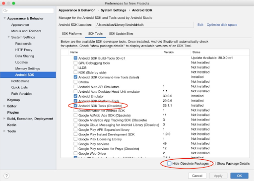

执行 flutter doctor 时提示：
```
[!] Android toolchain - develop for Android devices (Android SDK version 29.0.3)
    ✗ Android license status unknown.
      Try re-installing or updating your Android SDK Manager.
      See https://developer.android.com/studio/#downloads or visit
      https://flutter.dev/setup/#android-setup for detailed instructions.
```

在 Android Studio 3.6或以上版本，配置 Flutter 需要手动添加 Android SDK Tools 的旧版本：
1、打开 Android Studio 的 SDK Manager
2、在 Android SDK 选项, 取消选中隐藏弃用的包
3、选中 Android SDK Tools (Obsolete)

如下图:


